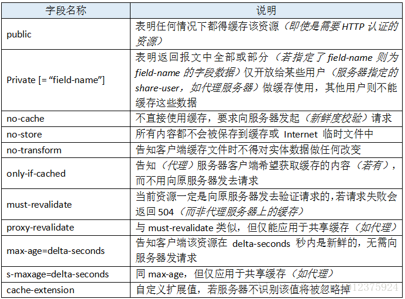
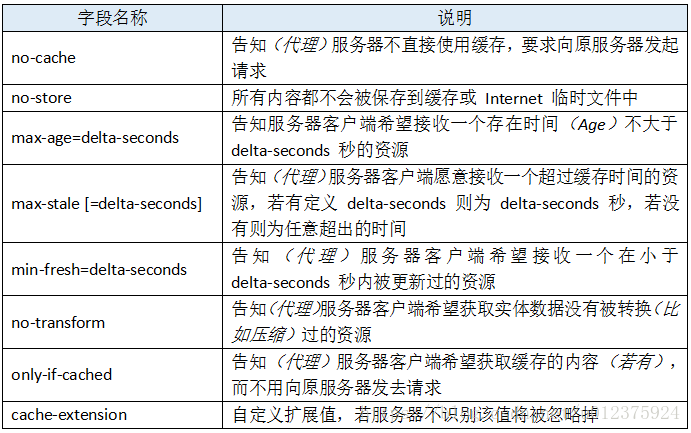

#浏览器缓存
  ## 强制缓存 (Expires和Cache-Control) 不会发请求到服务器
      > Expires 返回的HTTP状态为200 是HTTP 1.0提出的一个表示资源过期时间的header，它描述的是一个绝对时间，由服务器返回
        1.浏览器第一次跟服务器请求一个资源，服务器在返回这个资源的同时，在response的header加上Expires的header
        2.浏览器在接收到这个资源后，会把这个资源连同所有response header一起缓存下来（所以缓存命中的请求返回的header并不
          是来自服务器，而是来自之前缓存的header）
        3.浏览器再请求这个资源时，先从缓存中寻找，找到这个资源后，拿出它的Expires跟当前的请求时间比较，如果请求时间在
          Expires指定的时间之前，就能命中缓存，否则就不行
        4.如果缓存没有命中，浏览器直接从服务器加载资源时，Expires Header在重新加载的时候会被更新
        --------------------
        Expires 返回的是一个绝对时间 存在客户端和服务器端时间不一致的情况
      > Cache-Control 是HTTP 1.1的时候，提出了的一个新的header是一个相对时间，在配置缓存的时候，以秒为单位，用数值表示
        如：Cache-Control:max-age=315360000，  
         原理和Expires类似  如果同时存在 Expires和Cache-Control Cache-Control优先
         Cache-Control:public //允许所有服务器缓存该资源
         Cache-Control:private //表示该资源仅仅属于发出请求的最终用户，这将禁止中间服务器（如代理服务器）缓存此类资源
         Cache-Control:no-cache //不直接使用缓存，需要向服务器发送信息
         Cache-Control:no-store //所有内容不会被缓存或者保存在网络的临时文件中  优先级最高
         Cache-Control:only-if-cached  // 告诉代理服务器希望获取缓存的内容，不用向原服务器发送请求
         
         在请求中使用Cache-Control 时，它可选的值有：
         
         在响应中使用Cache-Control 时，它可选的值有：
         
  ## 协商缓存 (Last-Modified&Etag) 会发请求到服务器，如果命中协商缓存 返回304
      > 【Last-Modified，If-Modified-Since】的控制缓存的原理
         1.服务器在返回这个资源的同时，在response的header加上Last-Modified的header，这个header表示这个资源在服务器上的
           最后修改时间
         2.浏览器再次跟服务器请求这个资源时，在request的header上加上If-Modified-Since的header，这个header的值就是上一次
           请求时返回的Last-Modified的值 
         3.服务器判断   If-Modified-Since的值是否一致 ，一致返回304，复用浏览器的信息 如果没有命中Last-Modified Header
           在重新加载的时候会被更新，
         -------------------
         Last-Modified 返回服务器最后修改时间 当资源跟新频率特别高的时候可能存在 资源修改了，最后修改时间没有改变，所有
         有了新的hander
         【ETag、If-None-Match】  ETag返回的是 一个字符串 只要内容修改了ETag一定会改变，这样就不会出现 Last-Modified的
           情况了，原理和Last-Modified基本一致  命中返回304 复用浏览器缓存

    其他参考资料
     https://juejin.im/post/5b9346dcf265da0aac6fbe57
     https://blog.csdn.net/u012375924/article/details/82806617